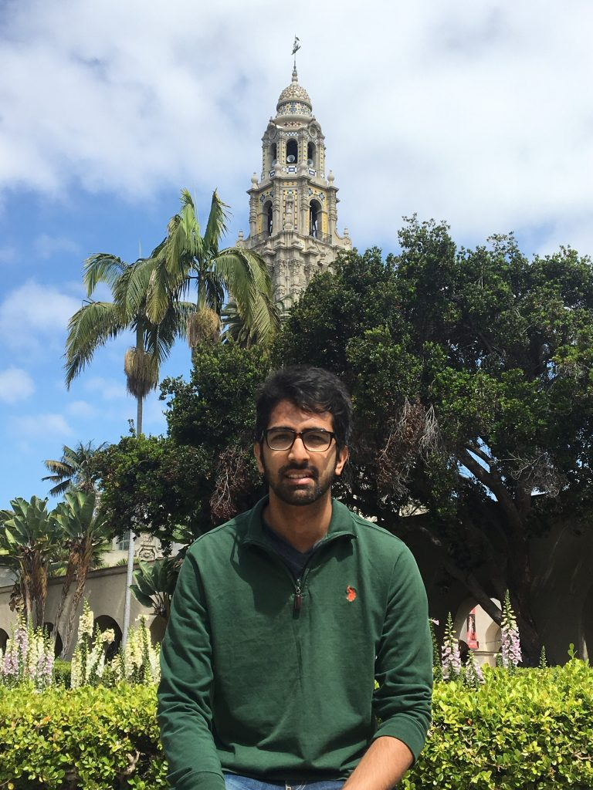
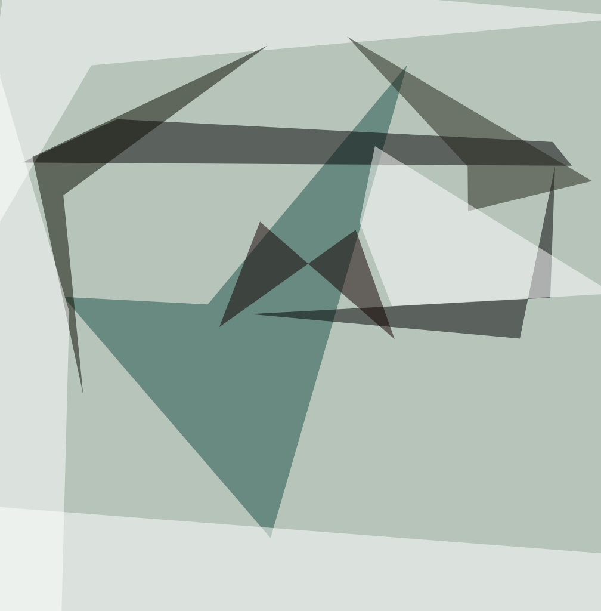
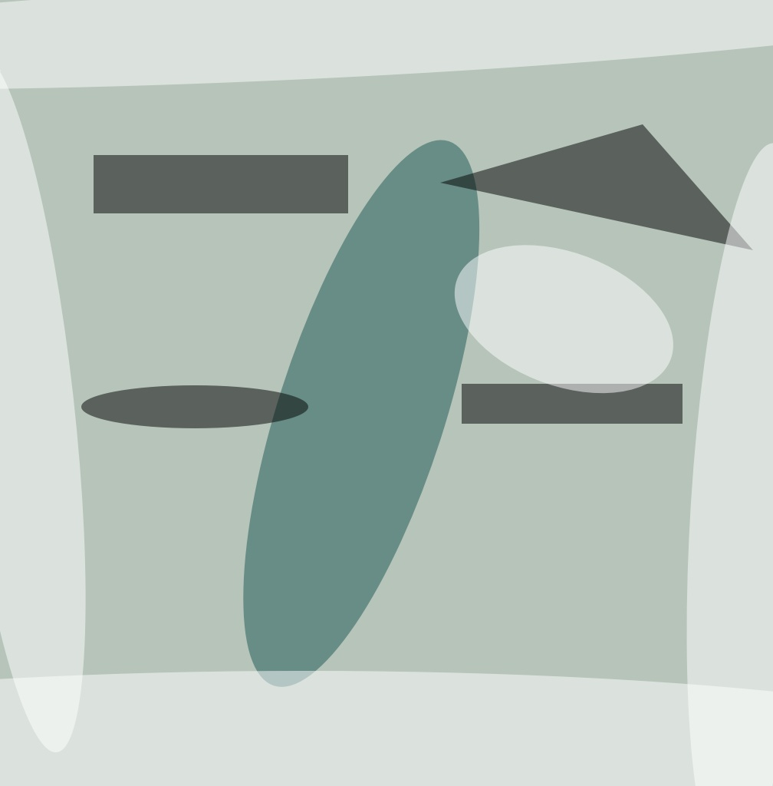
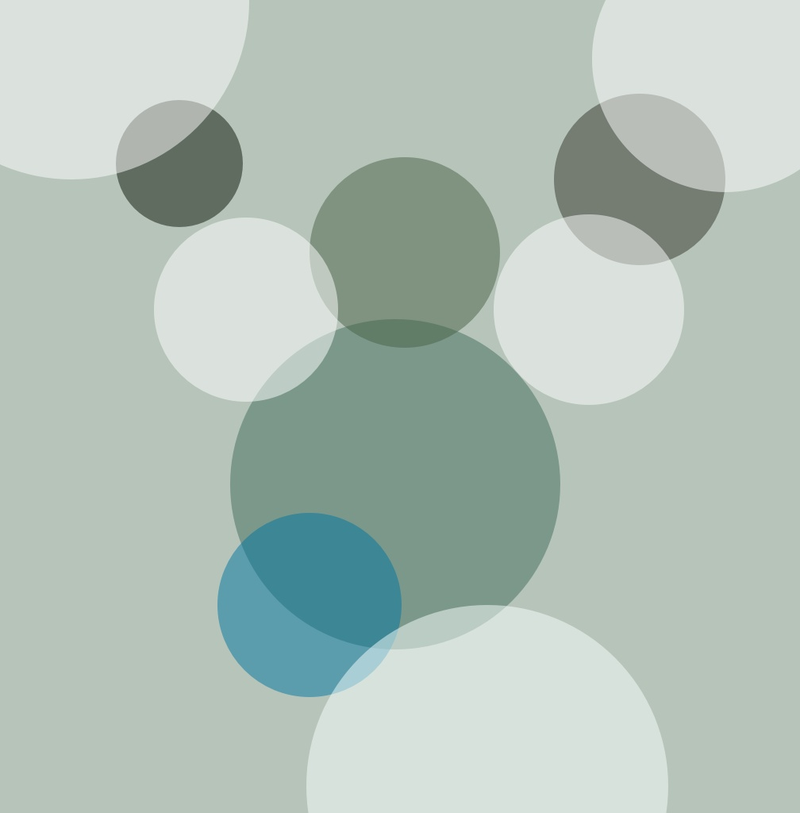
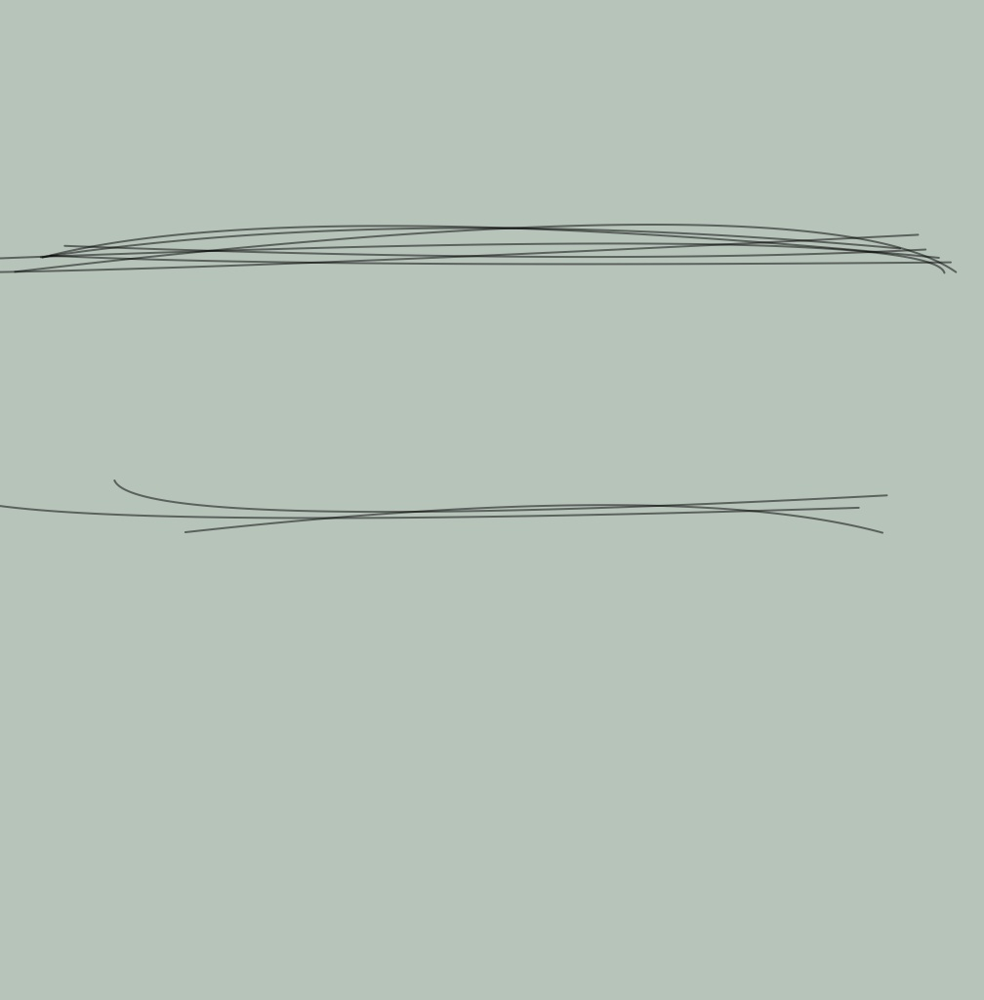
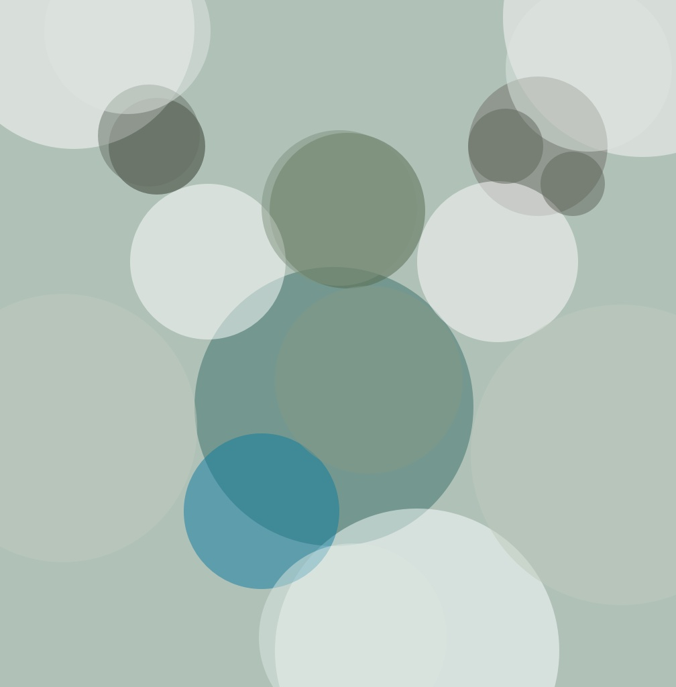

USAGE:

`go run main.go`

* Navigate to `localhost:3000`

* Select and upload an image

    -- Say, this image is uploaded:  
    </img>
    
    -- 4 transformed images will be created based on 4 different primitive modes.  
    </img>
    </img>
    </img>
    </img>
    
* Choose one of the transforms (Say circle)

    -- New transforms will be created for the selected primitive mode with different number of shapes.  
    </img>
    </img>
    </img>
    </img>
